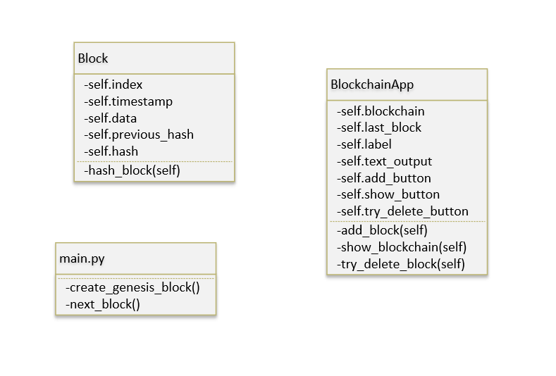
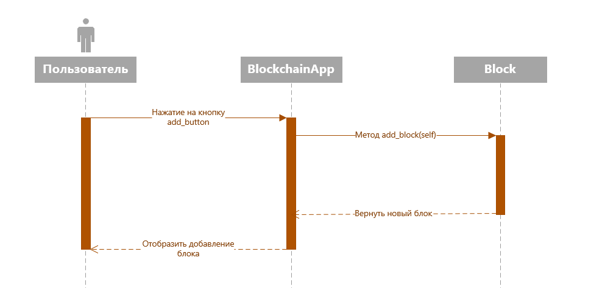
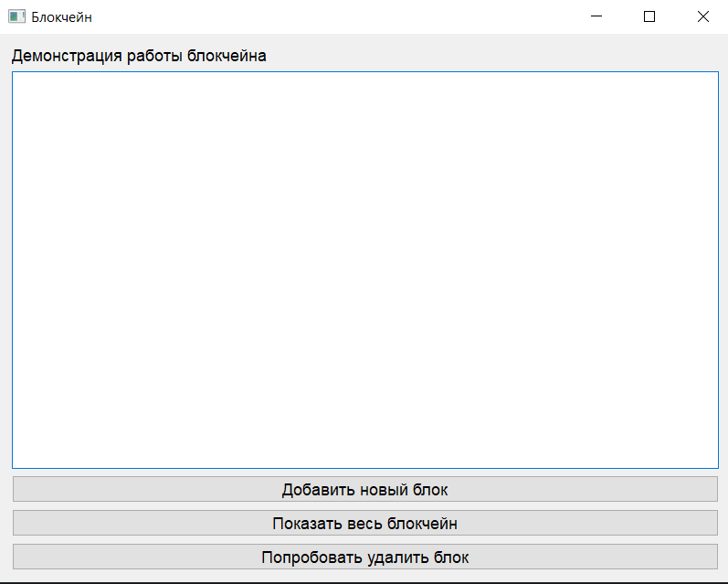
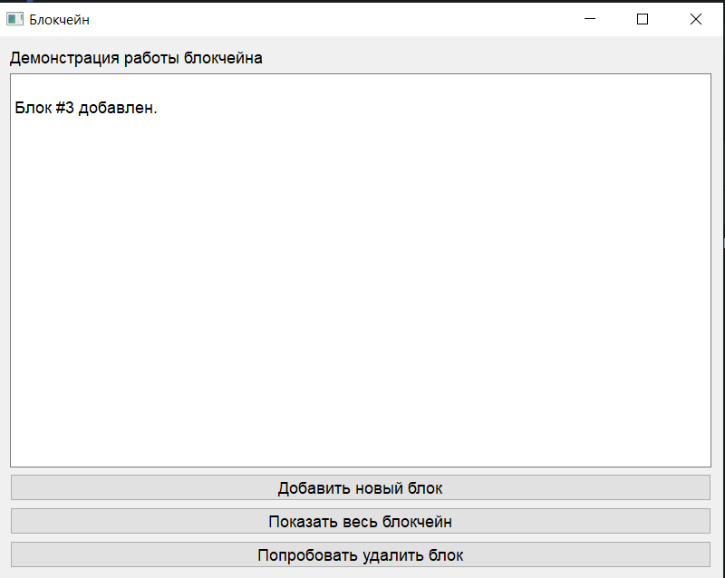
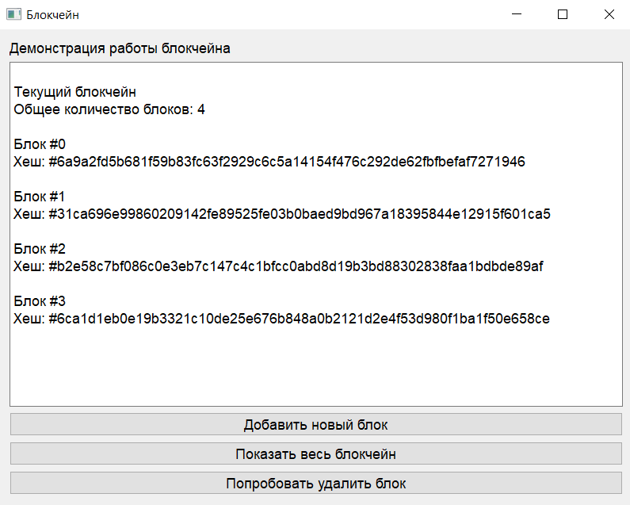
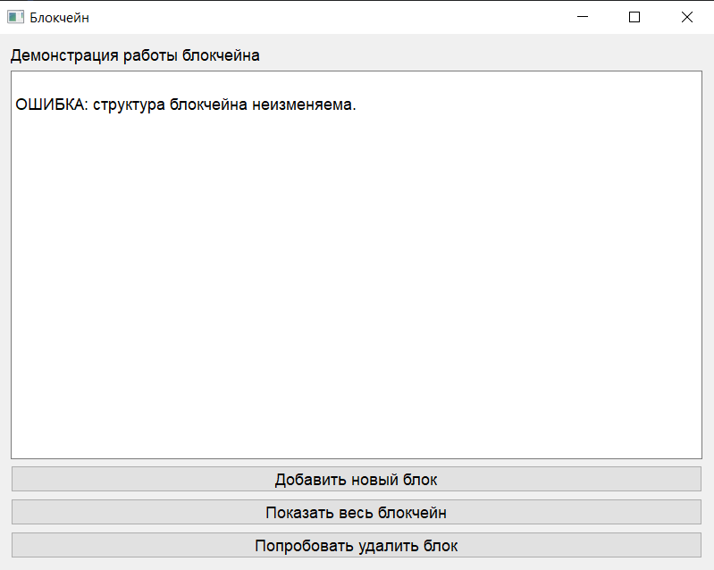

# Техническое руководство по созданию приложения «Интерфейс работы с блокчейном»

Студент: Ланщеков Егор Алексеевич

Группа: 241-326

### Введение

Данное руководство описывает процесс создания учебного программного продукта, реализующего работу с упрощённой моделью блокчейна в графическом интерфейсе пользователя на базе библиотеки PyQt5.

Приложение позволяет:

- Добавлять новые блоки в блокчейн.

- Просматривать текущее состояние цепочки.

- Демонстрировать принцип неизменяемости блокчейна через кнопку «Попробовать удалить блок», выводящую сообщение об ошибке.

Проект предназначен для учебных целей и демонстрирует принципы технологии блокчейн в наглядной форме.

# Архитектура приложения

Приложение состоит из двух основных частей:

**1. Логика блокчейна (backend):**

- Определение структуры блока (Block).

- Реализация функций создания генезис-блока и добавления новых блоков.

- Вычисление хэшей для связи блоков в единую цепочку.

**2. Графический интерфейс (frontend):**

- Построен на PyQt5.

- Содержит три кнопки и текстовое поле для вывода сообщений.

- Обеспечивает взаимодействие пользователя с блокчейном.

### Основные элементы приложения
**1. Класс Block**

Содержит данные о блоке:

- index — порядковый номер блока.

- timestamp — время создания блока.

- data — полезные данные.

- previous_hash — хэш предыдущего блока.

- hash — собственный хэш.

**2. Основные функции**

- create_genesis_block() — создаёт первый блок.

- next_block() — формирует новый блок, используя предыдущий.

**3. Графический интерфейс (PyQt5)**

GUI состоит из следующих элементов:

- Метка с описанием приложения.

- Текстовое поле (QTextEdit) для вывода сообщений и списка блоков.

- Кнопка «Добавить новый блок» — добавляет блок в цепочку.

- Кнопка «Показать весь блокчейн» — выводит список всех блоков.

- Кнопка «Попробовать удалить блок» — демонстрационная функция, выводящая сообщение об ошибке.

### Логика работы

При запуске программы создаётся генезис-блок.

Пользователь может нажимать кнопки:

- при добавлении нового блока цепочка увеличивается, и выводится сообщение о его добавлении;

- при просмотре отображаются все блоки;

- при попытке удаления появляется сообщение об ошибке.

Пример логики работы программы при добавлении нового блока:

### Модификация (творческая часть)

В рамках творческой модификации была реализована дополнительная кнопка «Попробовать удалить блок». Её цель — показать одно из фундаментальных свойств технологии блокчейн: неизменяемость цепочки блоков.

При нажатии данной кнопки приложение выводит сообщение:

_ОШИБКА: структура блокчейна неизменяема._

Таким образом, пользователь на практике убеждается, что после добавления блоков их удаление или модификация невозможно без нарушения целостности всей цепочки.

#### Таблица функций приложения:

| Кнопка |	Действие | Результат на экране |
|--------|-----------|---------------------|
| Добавить новый блок |	Создание нового блока | Сообщение о добавлении, увеличение количества блоков |
| Показать весь блокчейн | Вывод списка всех блоков	| Текстовое отображение цепочки блоков |
|Попробовать удалить блок |	Демонстрация невозможности изменения |	Сообщение об ошибке |

### Скриншоты программы

### Заключение

Разработанное приложение служит учебным инструментом для демонстрации работы технологии блокчейн в упрощённой форме. Использование PyQt5 позволяет создать наглядный интерфейс, что облегчает понимание принципов децентрализованного хранения данных и неизменяемости структуры блокчейна.
