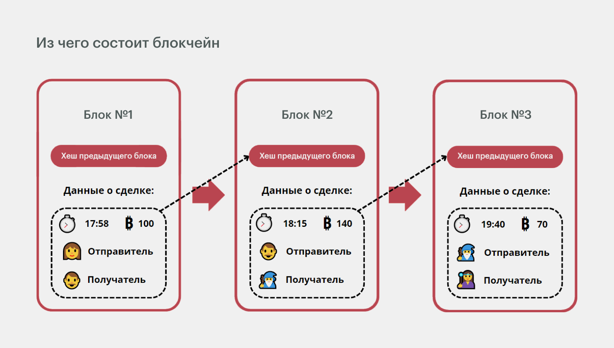
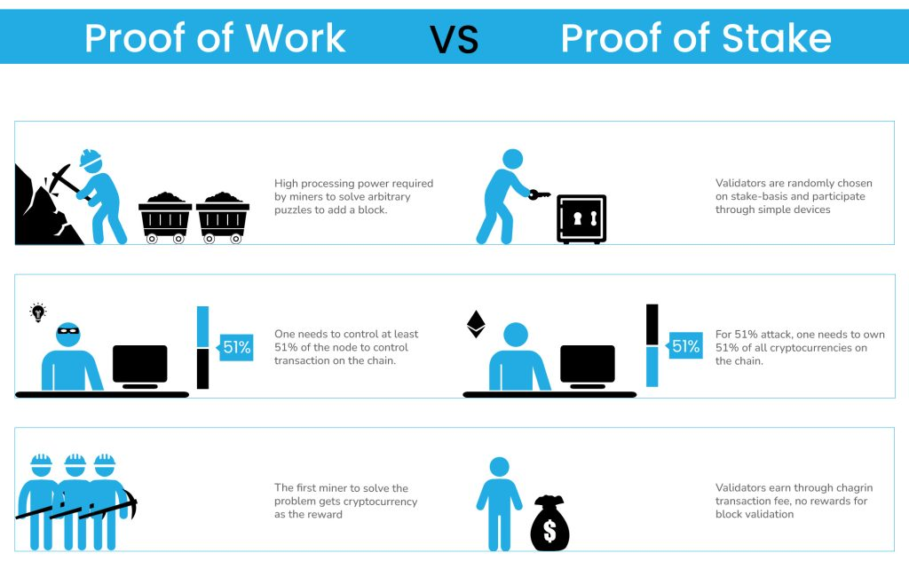
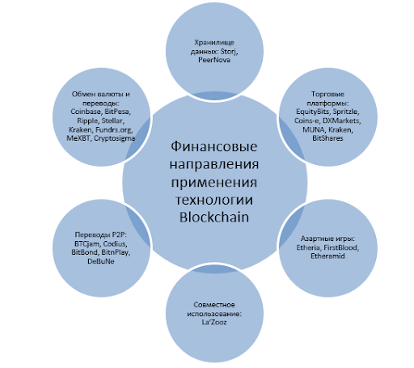

# Тема: Блокчейн
Студент: Ланщеков Егор Алексеевич

Группа: 241-326

### Введение

В последние годы технология блокчейн стала одним из наиболее обсуждаемых и востребованных направлений в области информационных технологий. Первоначально возникнув как основа для криптовалюты Bitcoin, блокчейн быстро вышел за пределы финансовой сферы и нашёл применение в самых разных областях: от управления цепочками поставок и цифровой идентификации до систем электронного голосования и смарт-контрактов.

В рамках проектной практики была выбрана тема «Блокчейн». Основной целью стало ознакомление с принципами работы технологии и практическая реализация её упрощённой модели на языке программирования Python. В качестве теоретической базы использована статья «Let’s Build the Tiniest Blockchain» (Medium, 2017), которая содержит краткое объяснение механики блокчейна и пример кода, реализующего минимальную версию этой технологии.

### 1. Исследование предметной области

При изучении технологии блокчейн важно выделить её ключевые особенности и отличия от традиционных баз данных:

- Децентрализация — отсутствует единый управляющий сервер, сеть формируется множеством узлов.


- Неизменяемость данных — после записи блок не может быть удалён или изменён без нарушения целостности всей цепочки.


- Криптографическая защита — каждый блок содержит хэш предыдущего блока, что гарантирует защиту от подделки.


- Прозрачность и проверяемость — все участники сети могут убедиться в корректности цепочки.

На основе изученной статьи и дополнительных материалов были выделены этапы, необходимые для понимания и построения прототипа блокчейна:

Ознакомление с теоретическими основами: блок, цепочка блоков, хэширование.

Анализ структуры минимальной реализации блокчейна.

Реализация кода на Python, позволяющего создать блоки и соединить их в цепочку.

Тестирование программы и проверка работы механизмов добавления новых блоков.

### 2. Теоретические основы блокчейна

#### 2.1. Структура блока

Каждый блок в блокчейне содержит:

- Метаданные (время создания, номер блока).

- Список транзакций или данные.

- Хэш предыдущего блока.

- Собственный хэш, вычисленный на основе всех полей.

Таким образом, блоки образуют цепочку, где каждый последующий блок зависит от предыдущего.



#### 2.2. Хэш-функции

Хэширование — это преобразование входных данных в строку фиксированной длины. В блокчейне используются криптографические хэши (например, SHA-256), обладающие свойствами устойчивости к коллизиям и невозможности обратного вычисления исходных данных.

#### 2.3. Алгоритм консенсуса

В реальных блокчейнах важным элементом является согласование действий всех участников сети. Существуют различные алгоритмы консенсуса (Proof-of-Work, Proof-of-Stake, BFT и др.), которые позволяют обеспечить достоверность данных. В минимальной реализации эти механизмы часто опускаются, чтобы упростить понимание.



### 3. Практическая реализация минимального блокчейна
#### 3.1. Основные шаги

- Создать структуру для представления блока.


- Реализовать функцию хэширования блока.


- Определить «генезис-блок» (первый блок в цепочке).


- Создать функцию для добавления новых блоков.


- Организовать хранение всей цепочки блоков.

#### 3.2. Пример реализации на Python

```

import hashlib as hasher


class Block:
    def __init__(self, index, timestamp, data, previous_hash):
        self.index = index
        self.timestamp = timestamp
        self.data = data
        self.previous_hash = previous_hash
        self.hash = self.hash_block()

    def hash_block(self):
        sha = hasher.sha256()
        # Create encoded string as a hash body
        hash_body = (str(self.index) + str(self.timestamp) + str(self.data) + str(self.previous_hash)).encode()
        sha.update(hash_body)
        return sha.hexdigest()


import datetime as date


def create_genesis_block():
    # Manually construct a block with
    # index zero and arbitrary previous hash
    return Block(0, date.datetime.now(), "Genesis Block", "0")

def next_block(last_block):
  index = last_block.index + 1
  timestamp = date.datetime.now()
  data = "Hey! I'm block " + str(index)
  return Block(index, timestamp, data, last_block.hash)


# Create the blockchain and add the genesis block
blockchain = [create_genesis_block()]
last_block = blockchain[0]

# How many blocks should we add to the chain
# after the genesis block
num_of_blocks_to_add = 5

# Add blocks to the chain
for i in range(0, num_of_blocks_to_add):
  block_to_add = next_block(last_block)
  blockchain.append(block_to_add)
  last_block = block_to_add

  print("Block #{} has been added to the blockchain!".format(block_to_add.index))
  print("Hash: {}\n".format(block_to_add.hash))
```

Вывод:
```
Block #1 has been added to the blockchain!
Hash: a100cf36a5d24cb7ca33ebdbb9ad56ad7652255ba5ecfbb60a2b3b275e66600d

Block #2 has been added to the blockchain!
Hash: 9b1b905f212cd0274b2d5e63ae570d44b22c98e28c74dab13d16ee72b4965ac6

Block #3 has been added to the blockchain!
Hash: a1ef010444097dcbd351b611b4b1f5944443976532cfdd943bc167f1c14a25ee

Block #4 has been added to the blockchain!
Hash: df3dc747cc73b9ebba3fc4e496a99d369474c003b41f0d56ba7255b0bac3ba01

Block #5 has been added to the blockchain!
Hash: a299db8281260059bdb8f952eec997e2bf2c8d9832cd9d9e925da740364da5fc

```
Данный код демонстрирует базовые механизмы: создание блоков, вычисление хэшей и построение цепочки.

### 4. Техническое руководство для начинающих
#### Шаг 1. Подготовка окружения

- Установить Python 3 (версии 3.8+).

- Проверить наличие библиотеки hashlib (встроена в стандартную библиотеку).

#### Шаг 2. Определение структуры блока

- Каждый блок должен содержать индекс, метку времени, данные и хэш предыдущего блока.

#### Шаг 3. Реализация хэширования

- Используем SHA-256 для создания уникального идентификатора блока.

#### Шаг 4. Создание генезис-блока

- Первый блок задаётся вручную, так как у него нет предшественников.

#### Шаг 5. Добавление новых блоков

- Новые блоки формируются на основе последнего блока в цепочке.

#### Шаг 6. Тестирование и расширение

- Проверить, что блоки связаны друг с другом через хэш.

### 5. Применение блокчейна

Данная модель наглядно демонстрирует принцип работы технологии. В реальных условиях блокчейн используется в следующих сценариях:

- Финансовые транзакции (Bitcoin, Ethereum).


- Управление цифровыми активами (NFT).


- Цепочки поставок (отслеживание товаров).


- Системы голосования (прозрачность и проверяемость).



### Заключение

В ходе выполнения работы была изучена технология блокчейн, её основные принципы и особенности. Реализация минимального прототипа на Python позволила на практике понять механизм формирования цепочки блоков и роль криптографических хэшей.

Блокчейн демонстрирует, каким образом можно обеспечить доверие в децентрализованных системах, и остаётся одной из наиболее перспективных технологий цифровой эпохи.