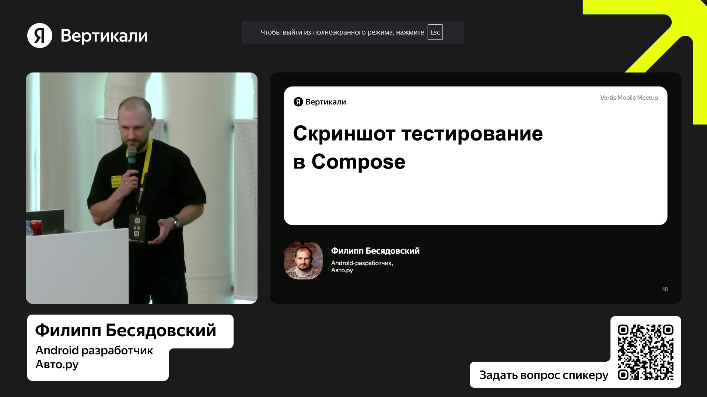
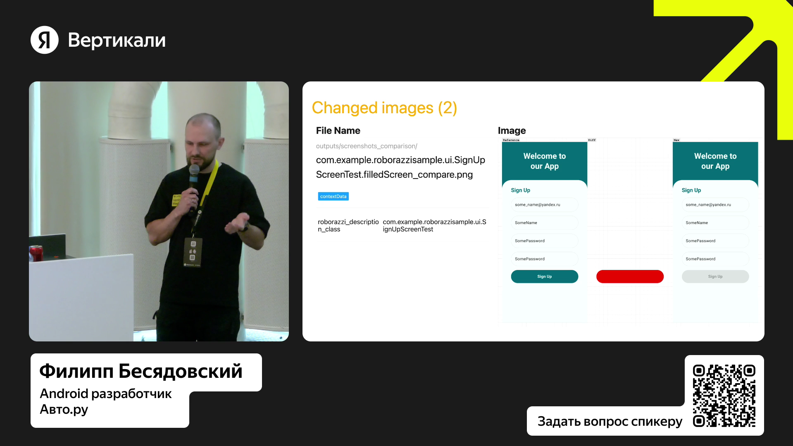

# Отчет о взаимодействии с организацией-партнером

Студент: Ланщеков Егор Алексеевич

Группа: 241-326

## Яндекс: конференция Vertis Meetup

**Тема**: особенности скриншот-тестирования ПО

**Дата**: 17 мая 2025

**Формат**: онлайн-конференция

«Яндекс» — это российская транснациональная технологическая компания, известная прежде всего своей системой поиска в интернете и обширной экосистемой цифровых сервисов.

### Что нового я узнал?
В ходе участия в конференции Yandex Vertis Meetup я познакомился с современными подходами к тестированию программных продуктов, уделив особое внимание практике скриншот-тестирования. Данный метод позволяет автоматизировать проверку интерфейсов и визуального представления приложений, фиксируя их текущее состояние в виде изображений и сравнивая их с эталонными образцами. Такой подход обеспечивает раннее выявление ошибок, связанных с изменением верстки, графических элементов или некорректным отображением контента, что особенно важно при работе в распределённых командах и в условиях регулярных обновлений программного обеспечения.

Основным преимуществом скриншот-тестирования является его наглядность и высокая воспроизводимость. В отличие от традиционных тестов, работающих с функциональной логикой, данный метод позволяет фиксировать и контролировать визуальную составляющую продукта, обеспечивая комплексное качество итогового решения. Кроме того, автоматизация процесса снижает нагрузку на ручных тестировщиков, ускоряет выпуск обновлений и способствует более высокому уровню доверия к результатам тестирования.

### Итог
Результатом посещения конференции стало расширение моего представления о современных методах обеспечения качества программных систем.
Полученные знания подтвердили актуальность автоматизированных практик тестирования и подчеркнули важность их интеграции в процессы разработки для повышения надежности и удобства конечных решений.